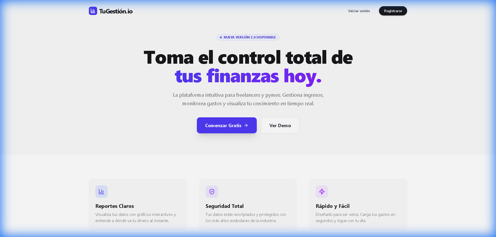
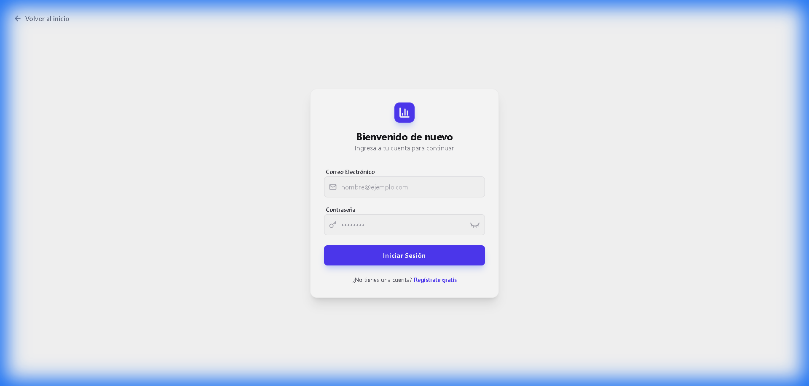
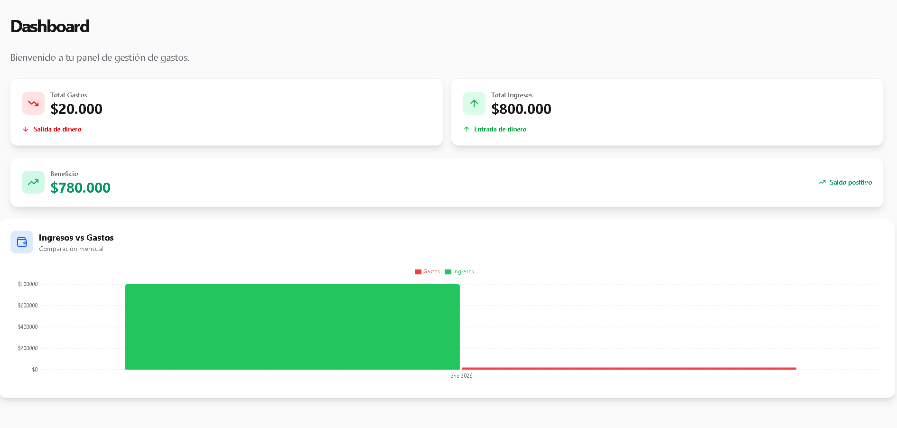
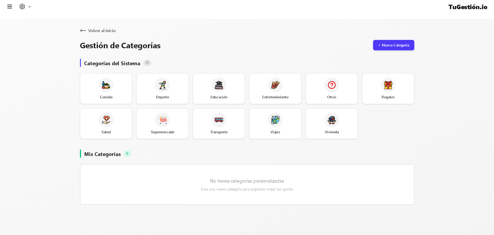
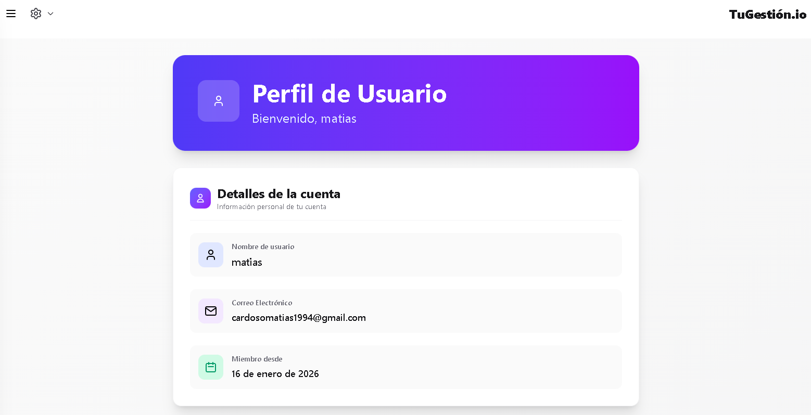

# Evolución Visual (Actualización a Paleta Índigo)

Hemos transformado la interfaz de usuario de un tema legado **Rojo/Gris/B&N** a un sistema de diseño moderno y vibrante en **Índigo/Zinc**.

### 🏠 Página de Inicio (Landing Actualizada)


---

### 🔄 Comparación de Interfaz (Blanco y Negro vs Índigo)

| Vista | Antes (Blanco y Negro) | Después (Índigo) |
| :--- | :---: | :---: |
| **Login** |  |  |
| **Register** |  |  |
| **Dashboard** |  |  |
| **Categories** |  |  |
| **Profile** |  |  |

---

### 🎨 Nuevos Iconos de Categoría
Se añadió un conjunto de iconos diseñados a medida para proporcionar una experiencia más intuitiva y visual en la gestión de categorías.

<p align="center">
  
  
  
  
  
  
  
  
  
  
</p>

---

# Gestión de Gastos

Aplicación web full-stack para la gestión de gastos personales. Permite a los usuarios registrarse, iniciar sesión, crear categorías de gastos, registrar nuevos gastos y visualizarlos de forma organizada.

## Tecnologías Utilizadas

### Backend

- **Node.js**: Entorno de ejecución para JavaScript.
- **Express**: Framework para la creación de la API REST.
- **TypeScript**: Superset de JavaScript que añade tipado estático.
- **PostgreSQL**: Base de datos para el almacenamiento de la información.
- **Zod**: Librería para la validación de esquemas y datos.
- **JWT (JSON Web Tokens)**: Para la autenticación y autorización de usuarios.
- **Bcrypt**: Para el hasheo de contraseñas.

### Frontend

- **React**: Biblioteca para la construcción de interfaces de usuario.
- **Vite**: Herramienta de desarrollo para proyectos frontend.
- **TypeScript**: Lenguaje de programación principal.
- **React Router DOM**: Para la gestión de rutas en la aplicación.
- **Tailwind CSS**: Framework de CSS para el diseño de la interfaz.
- **React Hook Form**: Para la gestión de formularios.
- **js-cookie**: Para el manejo de cookies en el navegador.

## Instalación y Uso

### Prerrequisitos

- Node.js (v18 o superior)
- npm (o un gestor de paquetes compatible)
- PostgreSQL

### Backend

1.  **Clonar el repositorio:**
    ```bash
    git clone https://github.com/tu-usuario/gestion-de-gastos.git
    cd gestion-de-gastos/backend
    ```

2.  **Instalar dependencias:**
    ```bash
    npm install
    ```

3.  **Configurar variables de entorno:**
    - Renombrar el archivo `.env.example` a `.env`.
    - Modificar las variables de entorno en el archivo `.env` con la configuración de tu base de datos y otros secretos.

4.  **Ejecutar la aplicación en modo de desarrollo:**
    ```bash
    npm run dev
    ```

### Frontend

1.  **Navegar al directorio del cliente:**
    ```bash
    cd ../client
    ```

2.  **Instalar dependencias:**
    ```bash
    npm install
    ```

3.  **Ejecutar la aplicación en modo de desarrollo:**
    ```bash
    npm run dev
    ```

La aplicación estará disponible en `http://localhost:5173`.
